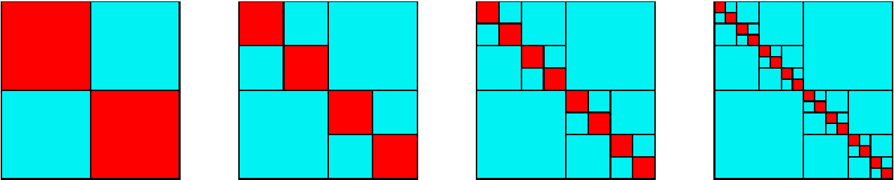

# Introduction

For Gaussian Process, the posterior update is given by

$$
\begin{aligned}
    \mu_{t+1}\parens{\xv} &= \kv_t\parens{\xv}^\top\parens{\Kv_t+\eta^2\Iv_t}^{-1}\yv_t, \\
    \sigma_{t+1}\parens{\xv} &= k\parens{\xv, \xv} - \kv_t\parens{\xv}^\top\parens{\Kv_t+\eta^2\Iv_t}^{-1}\kv_t\parens{\xv}.
\end{aligned}
$$

Also, the log likelihood used to select hyperparameters is given as:

$$
\log{p(\yv|\Xv,\thetav)} = - \frac{1}{2}\yv^{\top}\parens{\Kv+\eta^2\Iv}^{-1}\yv-\frac{1}{2}\log{|\Kv+\eta^2\Iv|}-\frac{n}{2}\log{2\pi}
$$

For large $n$, the computational cost of inverting $\KXX=\Kv_t+\eta^2\Iv_t$ and finding $|\KXX|$ is expensive; 
the traditional/direct methods via Cholesky decomposition scales quadratically.
The main contribution to the complexity is due to the factorization of the positive-semidefinite matrix $\KXX$ into $L \times L^\top$:

* In general, the time complexity is $O(n^3)$.
* Space complexity is $O(n^2)$, needed to store the lower triangular factor $L$ along with $\KXX$.

# Related Work

Broadly, there are generally 2 approaches; 
attempting to scale the factorization while preserving exact solution or performing approximations to speed-up computation.

1. Exact solutions - Find the exact solution to the matrix inversion.
    1. Naively using direct matrix inversion,
    1. Naively using $LU$ decomposition, 
    1. Cholesky decomposition, via the various numerical packages,
        * Implementation: Scikit-Learn (via Numpy, Blas/Lapack)
        * Implementation: GPy (via Scipy, Blas/Lapack)
        * Implementation: GPflow (via Tensorflow)
        * Implementation: GPTorch (via PyTorch)
        * Implementation: George (via Scipy, Blas/Lapack)
    1. Conjugate gradients method (CG)
        1. [Exact Gaussian Processes on a Million Data Points](https://arxiv.org/abs/1903.08114)
            * Implementation on GPyTorch: [Exact GPs with GPU Acceleration](https://docs.gpytorch.ai/en/latest/examples/02_Scalable_Exact_GPs/index.html#exact-gps-with-gpu-acceleration) (Original Author's)
    1. Hierarchical Off-Diagonal Low-Rank (HODLR) matrix factorization
        1. [Fast Direct Methods for Gaussian Processes](https://arxiv.org/pdf/1403.6015)
            * Implementation on George: [George](https://george.readthedocs.io/en/latest/) (Original Author's)
1. Approximate solutions - Trade-off accuracy to improve computational cost.
    1. Mixture-of-experts
    1. Sampling $m$ Inducing points
        1. Sparse and Variational Gaussian Process
            * Implementation on GPy: SVGP
        1. Sparse Gaussian Process Regression
            * Implementation on GPy: SGPR
    1. Random feature expansions

The key differece between the 2 approaches is the accurate computation of the log likelihood. 
Specifically, the approximate methods sacrifice accuracy for speed.
This work discusses the the impact of numerical issues with the computation on the hyperparameter learnt by the model: [Numerical issues in maximum likelihood parameter estimation for Gaussian process interpolation](https://arxiv.org/pdf/2101.09747.pdf).

## Exact Gaussian Processes on a Million Data Points

**Key Idea**: Instead of solving for $\KXX^{-1}$ to find $\xv$, we find $\xv$  directly:
$$
\xv^* = {\arg\min}_{\xv} {\Big(\frac{1}{2}\xv^\top \KXX\xv-\xv^\top\yv\Big)}
$$

* Unique minimizer $\xv$ exist due to positive definite $\KXX$
* Iterative algorithm with matrix-vector multiplication
* Iterations can be speed up with preconditioning 
* Able to decide tolerence of solution $\epsilon = ||\KXX\xv^*-\yv||/||\yv||$
* Similar to gradient descent, the difference is that CG enforces that the search direction $\pv_i$ is conjugate to each other.

*Note: In the absence of round-off error, it converge to exact solution after $n$ steps.*

### Process

Without forming the kernel matrix directly, using partitioned kernel MVM, 

* Time complexity of $O(\frac{n^3}{p})$ assuming that the computation is parallelized by $p$ partitions.
* Space complexity of $O(\frac{n^2}{p})$.

*Note: Time complexity of the process is not discussed in the paper, which needs further checking to be confident.*

#### MVM-based GP inference.

Partition the kernel matrix to perform all matrix-vector multiplications without forming kernel matrix explicitly.

1. Partition $\Xv = \sqparens{\Xv^{(1)}; \cdots; \Xv^{(l)}; \cdots; \Xv^{(p)}}$ to $p$ parts (row)
2. For each $l$ part:
    1. Compute $\widehat\Kv_{X^{(l)}X}$ with $\Xv^{(l)}, \Xv$
    2. Compute $\widehat\Kv_{X^{(l)}X} \uv$

Memory requirement $O(n^2/p)$; and when $p \rightarrow n$: $O(n)$.

#### Conjugate Gradients (CG) Computation.

Instead of solving for $\KXX^{-1}$ to find $\xv$, we find $\xv$  directly:
$$
\xv^* = {\arg\min}_{\xv} {\Big(\frac{1}{2}\xv^\top \KXX\xv-\xv^\top\yv\Big)}
$$

* Unique minimizer $\xv$ exist due to positive definite $\KXX$
* Iterative algorithm with matrix-vector multiplication
* Iterations can be speed up with preconditioning 
* Able to decide tolerence of solution $\epsilon = ||\KXX\xv^*-\yv||/||\yv||$
* Similar to gradient descent, the difference is that CG enforces that the search direction $\pv_i$ is conjugate to each other.

*Note: In the absence of round-off error, it converge to exact solution after $n$ steps.*

## Sampling $m$ Inducing points

1. Sparse and Variational Gaussian Process (SVGP) @hensman2014scalable selects inducing points $Z$ using a regularized objective.
2. Sparse Gaussian Process Regression (SGPR) @titsias2009variational introduces a set of variational parameters that can be optimized using minibatch training.

### Process

Along with finding the $m$-inducing points, the complexity required:

* Time complexity of $O(nm^2)$
* Space complexity of $O(nm)$

## Fast Direct Methods for Gaussian Processes

**Key Idea**: Assume that $\KXX$ is Hierarchical Off-Diagonal Low-Rank (HODLR) matrix, and can be factored 

$$
\KXX = K^{(0)} = \begin{bmatrix}
\MP{K}{1}{1} & \MP{U}{1}{1}{\MP{V}{1}{1}}^\top \\
\MP{V}{1}{1}{\MP{U}{1}{1}}^\top & \MP{K}{2}{1} 
\end{bmatrix},
$$

where the diagonal blocks are recursive HODLR decompositions 

$$
\MP{K}{1}{1} = \begin{bmatrix}
\MP{K}{1}{2} & \MP{U}{1}{2}{\MP{V}{1}{2}}^\top \\
\MP{V}{1}{2}{\MP{U}{1}{2}}^\top & \MP{K}{2}{2} 
\end{bmatrix}, \;\;\;
\MP{K}{2}{1} = \begin{bmatrix}
\MP{K}{3}{2} & \MP{U}{2}{2}{\MP{V}{2}{2}}^\top \\
\MP{V}{2}{2}{\MP{U}{2}{2}}^\top & \MP{K}{4}{2} 
\end{bmatrix},
$$

and that $\MP{U}{i}{j},\MP{V}{i}{j}$ are $\frac{n}{2^j}\times r$ matrices.
We note that the off-diagonal matrices are low-rank matrices and can be approximated by $\MP{U}{i}{j},\MP{V}{i}{j}$ up to a factorization precision $\epsilon$.
The decompositions can be performed recursively up to the $\kappa$-level where $\kappa \sim \log{n}$;
i.e. $\KXX = K_\kappa K_{\kappa-1} \cdots K_{0}$, see below.

### Process

The overall runtime to obtain the matrix inverse of $\KXX$ and its determinant $|\KXX|$ is $O(n\log^2{n})$:

* The factorization of an $n \times n$, $\kappa$-level (where $\kappa \sim \log n$) HODLR matrix takes $O(n\log^2{n})$.
* Given a HODLR-type factorization, finding the inverse takes $O(n\log{n})$.
* Given a HODLR-type factorization, finding the determinant takes $O(n\log{n})$.

The overall space required scales to the number of dense matrices $n/2^{\kappa}\times n/2^{\kappa}$:

* $O(2^{\kappa} \times \frac{n^2}{4^{\kappa}}) = O(\frac{n^2}{2^{\kappa}})$, assuming $\kappa = \log_2{n}$, $O(n)$.

*Note: Original paper did not discuss space complexity, need to put more thought and experiments; It is also not practical to subdivide completely, the authors implementation subdivide until a certain specified size.*

#### Matrix Inversion.

The summarized process to obtain the inverse (details are in the paper):

1. Computing the low-rank factorization of all off-diagonal block
1. Using these low-rank approximations to recursively factor the matrix into roughly $O(\log{n})$ pieces.
1. Sherman-Morrison-Woodbury formula can be applied to the $O(\log{n})$ factors to find the inverse.

#### Determinant Computation.

Using the HOLDR factorization, the determinant can be computed directly:

$$
|\KXX|=|K_\kappa| \times |K_{\kappa-1}| \times \cdots \times |K_{0}|
$$

## Metrics commonly used in Literature

In this section, we review the various metrics used by the various papers, in a attempt to find the best for us:

1. [Exact Gaussian Processes on a Million Data Points](https://arxiv.org/abs/1903.08114): Dataset is split into $4:2:3$ - training, validating and testing sets. Validation is used to tune the CG parameters, the metrics are computed on test set.
    1. Accuracy - Root-Mean-Square Error on the test set, and is heavily used to discuss the performance of the method, on 12 UCI datasets.
        $$RMSE = \sqrt{\frac{1}{n}\Sigma_{i=1}^{n}{\Big(y^*_i -y_i)^2}}$$
    1. Accuracy - Negative log-likelihood of the exact GP is shown along with the approximate methods, but it is not used to discuss at all.
    1. Compute Time - Training Time, Testing Time 
1. [Fast Direct Methods for Gaussian Processes](https://arxiv.org/pdf/1403.6015): 
    1. Accuracy - Relative $l_2$ precision in the solution to a test problem $Cx = b$, where $b$ was generated a priori from the known vector $x$, where $C$ is synthetically created from a linear combination of:
        1. Gaussian covariance
        1. Multiquadric covariance matrice
        1. Exponential covariance
    1. Accuracy - Difference of the Root-Mean-Square Errors of the exact method vs HOLDR on a synthetic function $\sin(2x)+\frac{1}{8}{\rm e}^x+\epsilon$.
    1. Compute Time - Assembly Time, Factor Time, Solve Time and Determinant Compute Time.
1. [Numerical issues in maximum likelihood parameter estimation for Gaussian process interpolation](https://arxiv.org/pdf/2101.09747.pdf):
    1. Accuracy - Root mean squared prediction error (ERMSPE)
    1. Optimization is run on the model to find the optimal hyperparameters, then:
        1. Accuracy - Lengthscale
        1. Accuracy - Variance
        1. Accuracy - Negative log-likelihood
        1. Accuracy - Values of each individual term in the computation of the GP model.

## Some thoughts

1. RMSE on test set must be used for accuracy comparison.
1. We can test synthetic accuracy using $Cx = b$.
1. We need to get a notion of the computational relative floating point error for the operations that we care about.
1. What is there a theoretical error that we can achieve?

\newpage

# Motivation

Our key motivations for improving *Holdr* is as follows:

1. *Holdr* is fast; The runtime complexity is very good when compared to the next state-of-the-art.
1. *Holdr* is space efficient; The space complexity is very good when compared to the next state-of-the-art.
1. *Holdr* is not accurate; it relies on the assumption that $\KXX$ resembles a HODLR matrix; failing which, the accuracy of the matrix inversion and determininant computations is affected in unpredictable ways. The accuracy of the computation improved by setting the factorization precision $\epsilon$ to a smaller number, but the computation can still fail unpredictably.
1. $\KXX$ can be conditioned, into an equlivant hierarchical matrix $\KXXp$ by performing some reordering operations on $X\rightarrow X'$, improving the matrix structure.

## *Holdr* is fast

The main advantage of *Holdr* when compared to other methods is that it is very fast (at scale).
Even with a small $\epsilon = 0.000001$, *Holdr* is competitive on time.
All methods use only the CPU; Alex is converted from running on GPU to running on CPU.
We let Alex select the optimal kernel size based on the avaliable memory, thereby parallelizing on the CPU.
Experiments here are done on the Synthetic Function, $\sin(x)$, each datapoint is the average over $100$ independent runs, over the best of the 10 measurements done for each run.

{width=50%}

*Note: Some numerical instability with GPyT due to the implementation on PyTorch; the computation of Cholesky decomposition could not go through for <5\% of the experiments and it is not reflected here. Will fix this shortly.*

## *Holdr* is space efficient

The next key advantage of *Holdr* when compared to other methods is that it is very space efficient (at scale).

\begin{figure}
     \centering
     \begin{subfigure}[b]{0.49\textwidth}
         \centering
         \includegraphics[width=\textwidth]{export/fn-sin-perf/BoxPlot/N20000_ru_maxrss_KB-BoxPlot-ru_maxrss_KB.pdf}
         \caption{Memory used at $N=20000$.}
         \label{fig:mem_used_N20000}
     \end{subfigure}
     \hfill
     \begin{subfigure}[b]{0.49\textwidth}
         \centering
         \includegraphics[width=\textwidth]{export/fn-sin-perf/BoxPlot/N100000_ru_maxrss_KB-BoxPlot-ru_maxrss_KB.pdf}
         \caption{Memory used at $N=100000$.}
         \label{fig:mem_used_N100000}
     \end{subfigure}
    \caption{Holdr with $\epsilon=0.000001$ when compared with other methods.}
    \label{fig:mem_used}
\end{figure}

*Note: Some issues with the how the memory required is measured, but comparisons within the same $N$ is OK.*

## *Holdr* is not accurate

From [Inconsistent results with HODLRSolver](https://github.com/dfm/george/issues/128), we see that there are accuracy issues in its use. 
The accuracy of the computation improved by setting the factorization precision $\epsilon$ to a smaller number, but the computation can still fail unpredictably.

We can run *Holdr* with different factorization precisions $\epsilon\in\{1e^{-i} : i \in [1,6]\}$ to determine its effects on accuracy and runtime complexity.
We let the accurate log likelihood of the $X$ to be $\ell^*$, computed using Cholesky decomposition. 
We compute the log likelihood $\ell_\text{HODLR}$ using the HODLR matrix factorization with the various $\epsilon$.

\begin{figure}
     \centering
     \begin{subfigure}[b]{0.32\textwidth}
         \centering
         \includegraphics[width=\textwidth]{export/holdr-acc/BoxPlot/rel_err_ll-BoxPlot-rel_err_ll.pdf}
         \caption{Effects on $\frac{|\ell^*-\ell_\text{HODLR}|}{\ell^*}$.}
         \label{fig:holdr_rel_err_logl}
     \end{subfigure}
     \hfill
     \begin{subfigure}[b]{0.32\textwidth}
         \centering
         \includegraphics[width=\textwidth]{export/holdr-acc/BoxPlot/rmse-BoxPlot-rmse.pdf}
         \caption{Effects on RMSE.}
         \label{fig:holdr_rmse}
     \end{subfigure}
     \hfill
     \begin{subfigure}[b]{0.32\textwidth}
         \centering
         \includegraphics[width=\textwidth]{export/holdr-perf/BoxPlot/time_taken_ns-BoxPlot-time_taken_ns.pdf}
         \caption{Effects on Time Taken.}
         \label{fig:holdr_time}
     \end{subfigure}
    \caption{Holdr with different factorization precisions.}
    \label{fig:holdr}
\end{figure}

We see clearly from \ref{fig:holdr_rel_err_logl} that with a small $\epsilon$, it improves the average error but at an expense of high deviation. 
In other words, factoring with a small factorization precision yields better results on the average but can fail unpredictably.
This give rise to the instability of the computation of log likelihood, which can adversely affect the optimization of model hyperparameters and subsequently RMSE (see \ref{fig:holdr_rmse}).

This issue was discussed in passing in the paper, see below; The authors concluded that it is not an issue and presented a suggestion to use kd-tree sort to condition the matrix $\KXX$. However, the authors reversed this viewpoint in [Issue 128](https://github.com/dfm/george/issues/128).

> We note that the authors claimed that when the data points at which the kernel to be evaluated at are not approximately uniformly distributed, the performance of the factorization may suffer, but only slightly. A higher level of compression could be obtained in the off-diagonal blocks if the hierarchical tree structure is constructed based on spatial considerations instead of point count, as is the case with some kd-tree implementations.

Most importantly, the time taken needed to compute $\epsilon=1e^{-i}$ scales well.
Even at a small factorization precision $i=6$, it is still faster than the fastest competition.
This gives us a window of opportunity spend some compute time to condition $\KXX$, even at $i=6$.

## $\KXX$ can be conditioned

The key insight is that the the closer the kernel matrix is to an hierarchical matrix, the better the accuracy.
Since `HOLDR` is fast, we want to pay some computational cost to condition the matrix. 
We see that we can perform some reordering operations on $X=[x_0, \cdots, x_n]\rightarrow X'$ to massage^[Do we need to show that such set of operations exist?] the kernel matrix $\KXX$ into an equlivant hierarchical matrix $\KXXp$.
Here, equlivant means that the reordering operation does not change values of the posterior updates and the marginal likelihood ^[Do we need a proof?].

$$
\KXX = 
\begin{blockarray}{ccccc}
x_0 & x_1 & x_2 & x_3 \\
\begin{block}{[cccc]c}
  1 & 0 & 4 & 0 & x_0 \\
  0 & 1 & 0 & 2 & x_1 \\
  4 & 0 & 1 & 0 & x_2 \\
  0 & 2 & 0 & 1 & x_3 \\
\end{block}
\end{blockarray}
\rightarrow
\begin{blockarray}{ccccc}
x_0 & x_2 & x_1 & x_3 \\
\begin{block}{[cccc]c}
  1 & 4 & 0 & 0 & x_0 \\
  4 & 1 & 0 & 0 & x_2 \\
  0 & 0 & 1 & 2 & x_1 \\
  0 & 0 & 2 & 1 & x_3 \\
\end{block}
\end{blockarray}
= \KXXp
$$

We will find the hierarchical matrix $\KXXp$ and its corresponding reordered $X'$ for which allows us to achieve a good accuracy of the log likelihood $\log{p(\yv|\Xv,\thetav)}$.

# Proof-of-Concept

Here, we demonstrate the feasibility of our concept by using the *optimal* metric with Genetic Algorithm.
We formulate the problem as a optimization problem and use Genetic Algorithm (GA) to find $X'$, with each $i$-iteration candidate solution to be $X_i$. 
We run the GA with $1000$ iterations and population size of $20$:

* Mutation operation: Swapping of 2 points $x_i,x_j$ where $i,j$ are indices from different groups.
* Fitness score: Absolute difference of the accurate log likelihood and the current log likelihood $|\ell^*-\ell^{(i)}|$

\begin{figure}[!h]
    \centering
    \includegraphics[width=.25\textwidth]{GA-initial.png}
    \includegraphics[width=.25\textwidth]{GA-mid.png}
    \includegraphics[width=.25\textwidth]{GA-final.png}
\caption{Heatmap of the $\KXX$ matrices, showing from $X_0\rightarrow X_{20} \rightarrow X_{1000}$.}
\end{figure}

From above, we see that the concept works, choosing a solution $X_i$ that is incrementally closer to the better solution than $X_{i-1}$.
We summarize the results as follows:

$$
\ell^{(0)} = 23.52 \rightarrow \ell^{(1000)} = 31.34 \sim \ell^* = 31.34
$$

Hence, we are confident that it would be possible to perform a reordering operation on $X$ such that its kernel matrix is a hierarchical matrix.

# Genetic Algorithm

We are after all aiming to achieve that as a result of our optimization, so using it in our optimization would be cheating, and not to mention not cheap computationally. Here, we will use the same settings as in the proof of concept, with the exception of the fitness function.

## Sum of off-diagonal matrix

$$
\KXX = K^{(0)} = \begin{bmatrix}
\MP{K}{1}{1} & \MP{U}{1}{1}{\MP{V}{1}{1}}^\top \\
\MP{V}{1}{1}{\MP{U}{1}{1}}^\top & \MP{K}{2}{1} 
\end{bmatrix},
$$

Here, we are using the sum over the cells in the off-diagonal matrix $\MP{V}{1}{1}{\MP{U}{1}{1}}^\top$. 
We aim to find a reordering such that the sum over the off-diagonal matrix is minimum.

\begin{figure}[!h]
    \centering
    \includegraphics[width=.25\textwidth]{GA-initial.png}
    \includegraphics[width=.25\textwidth]{GA-sum.png}
\caption{Heatmap of the $\KXX$ matrices - left is the kernel matrix of $X_0$, right is after.}
\end{figure}

$$
\ell^{(0)} = 23.52 \rightarrow \ell^\text{(GA-Sum)} = 31.44, \frac{|\ell^*-\ell^\text{(GA-Sum)}|}{\ell^*}=0.307\%
$$

## Rank of off-diagonal matrix

Similar to the sum as above, instead we use the rank of the off-diagonal matrix $\MP{V}{1}{1}{\MP{U}{1}{1}}^\top$.
This is from the definition of hierarchical matrix.

\begin{figure}[!h]
    \centering
    \includegraphics[width=.25\textwidth]{GA-initial.png}
    \includegraphics[width=.25\textwidth]{GA-rank.png}
\caption{Heatmap of the $\KXX$ matrices - left is the kernel matrix of $X_0$, right is after.}
\end{figure}

$$
\ell^{(0)} = 23.52 \rightarrow \ell^\text{(GA-Rank)} = 31.44, \frac{|\ell^*-\ell^\text{(GA-Rank)}|}{\ell^*}=0.307\%
$$

We see that there is not much difference between using the rank and the sum of cells, 
with the exception of the increased computation needed to calculate the rank.

# Sorting

## KD-Tree

As a simplified example, we build a KD-Tree on $X$ and query the tree  on the closest $n$ points to $x_0$.

\begin{figure}[!h]
    \centering
    \includegraphics[width=.25\textwidth]{GA-initial.png}
    \includegraphics[width=.25\textwidth]{kdtree.png}
\caption{Heatmap of the $\KXX$ matrices - left is the kernel matrix of $X_0$, right is after.}
\end{figure}

$$
\ell^{(0)} = 23.52 \rightarrow \ell^\text{(Sort-KD)} = 29.14, \frac{|\ell^*-\ell^\text{(Sort-KD)}|}{\ell^*}=7.03\%
$$

We observe that this method works marginally; 
However, KD-Trees are unsuitable for finding nearest neighbours in high dimensions due to curse of dimensionality. 
We expect the performance of this method to rapidly degrade in higher dimensionlity.

# Clustering

## Vanilla K-Means

Here, we perform vanilla K-means on $X$ to find $2$ clusters.
We do not tweak/restrict the distance metric and the cluster size.
Then, we sort the points based on the point's cluster identity.

\begin{figure}[!h]
    \centering
    \includegraphics[width=.25\textwidth]{GA-initial.png}
    \includegraphics[width=.25\textwidth]{cluster-vanilla.png}
\caption{Heatmap of the $\KXX$ matrices - left is the kernel matrix of $X_0$, right is after.}
\end{figure}

$$
\ell^{(0)} = 23.52 \rightarrow \ell^\text{(Cluster-Vanilla)} = 31.36, \frac{|\ell^*-\ell^\text{(Cluster-Vanilla)}|}{\ell^*}=0.0618\%
$$

Since we did not make any restrictions; we can expect that the cluster might be imbalanced.

\newpage

## Sized K-Means

We take into account the equal sized constraint, as given in [Same-size k-Means Variation](https://elki-project.github.io/tutorial/same-size_k_means).
The implementation used to test is given in [https://github.com/ndanielsen/Same-Size-K-Means](https://github.com/ndanielsen/Same-Size-K-Means).

\begin{figure}[!h]
    \centering
    \includegraphics[width=.25\textwidth]{GA-initial.png}
    \includegraphics[width=.25\textwidth]{cluster-sized.png}
\caption{Heatmap of the $\KXX$ matrices - left is the kernel matrix of $X_0$, right is after.}
\end{figure}

$$
\ell^{(0)} = 23.52 \rightarrow \ell^\text{(Cluster-Sized)} = 31.35, \frac{|\ell^*-\ell^\text{(Cluster-Sized)}|}{\ell^*}=0.0171\%
$$

## Distanced K-Means

We take into account the kernel distance $k\parens{x_i, x_j}$, replacing the default euclidean distance.
Implementation used is from [pyclustering](https://pyclustering.github.io/).

\begin{figure}[!h]
    \centering
    \includegraphics[width=.25\textwidth]{GA-initial.png}
    \includegraphics[width=.25\textwidth]{cluster-distanced.png}
\caption{Heatmap of the $\KXX$ matrices - left is the kernel matrix of $X_0$, right is after.}
\end{figure}

$$
\ell^{(0)} = 23.52 \rightarrow \ell^\text{(Cluster-Distanced)} = 31.29, \frac{|\ell^*-\ell^\text{(Cluster-Distanced)}|}{\ell^*}=0.169\%
$$

We expect this method to perform better, also the matrix looks a little odd.

# Graph 

We can model the problem as a graph problem:

1. Vertex: Each $x_i$
1. Edge: $x_i\rightarrow x_j$, where weight is given by $k\parens{x_i, x_j}$

Then, we are trying to find the a balanced, minimum cut of the graph. This problem is known also:

1. Planted Bisection Problem
1. Stochastic block model with two communities
1. Minimum bisection problem

Related resources:

1. [On Minimum Bisection and Related Cut Problems in Trees and Tree-Like Graphs](https://arxiv.org/abs/1708.06411)
1. [Exact Recovery in the Stochastic Block Model](https://ieeexplore.ieee.org/abstract/document/7298436/)
1. [Community Detection in Networks: Algorithms, Complexity, and Information Limits](https://www.youtube.com/watch?v=zhszI5rYVpc)
1. [MIT - mathematics of data science fall 2015](https://ocw.mit.edu/courses/mathematics/18-s096-topics-in-mathematics-of-data-science-fall-2015/lecture-notes/MIT18_S096F15_Ses22.pdf)
1. [Minimum Cut Graphs](https://www.baeldung.com/cs/minimum-cut-graphs)
1. [An efficient heuristic procedure for partitioning graphs](https://ieeexplore.ieee.org/document/6771089)
1. [A Linear-Time Heuristic for Improving Network Partitions](http://web.eecs.umich.edu/~mazum/fmcut1.pdf)
    1. Implementaion is avaliable here [kshitij1489/Graph-Partitioning](https://github.com/kshitij1489/Graph-Partitioning), but it is in Cpp.
1. [From Louvain to Leiden: guaranteeing well-connected communities](https://arxiv.org/abs/1810.08473)

## Kernighan-Lin Graph Bisection

Partition a graph into two blocks using the Kernighan–Lin algorithm; see [An efficient heuristic procedure for partitioning graphs](https://ieeexplore.ieee.org/document/6771089).

This algorithm partitions a network into two sets by iteratively swapping pairs of nodes to reduce the edge cut between the two sets. The pairs are chosen according to a modified form of Kernighan-Lin, which moves node individually, alternating between sides to keep the bisection balanced.

\begin{figure}[!h]
    \centering
    \includegraphics[width=.25\textwidth]{GA-initial.png}
    \includegraphics[width=.25\textwidth]{graph-kernighan.png}
\caption{Heatmap of the $\KXX$ matrices - left is the kernel matrix of $X_0$, right is after.}
\end{figure}

$$
\ell^{(0)} = 23.52 \rightarrow \ell^\text{(Graph-Kernighan)} = 31.38, \frac{|\ell^*-\ell^\text{(Graph-Kernighan)}|}{\ell^*}=0.108\%
$$

## Louvain Community Detection

Compute the partition of the graph nodes which maximises the modularity using the Louvain heuristices. 
This is the partition of highest modularity, i.e. the highest partition of the dendrogram generated by the Louvain algorithm.
Implementation is from [python-louvain](https://python-louvain.readthedocs.io/en/latest/index.html), also see [Fast unfolding of communities in large networks](https://arxiv.org/abs/0803.0476).

\begin{figure}[!h]
    \centering
    \includegraphics[width=.25\textwidth]{GA-initial.png}
    \includegraphics[width=.25\textwidth]{graph-louvain.png}
\caption{Heatmap of the $\KXX$ matrices - left is the kernel matrix of $X_0$, right is after.}
\end{figure}

$$
\ell^{(0)} = 23.52 \rightarrow \ell^\text{(Graph-Louvain)} = 29.44, \frac{|\ell^*-\ell^\text{(Graph-Louvain)}|}{\ell^*}=6.065\%
$$

## Leiden Community Detection

[leidenalg](https://leidenalg.readthedocs.io/en/latest/intro.html) - yet to try

# Linear Algebra 

## Principal Component Analysis (PCA)

<!-- [https://math.stackexchange.com/questions/23596/why-is-the-eigenvector-of-a-covariance-matrix-equal-to-a-principal-component](https://math.stackexchange.com/questions/23596/why-is-the-eigenvector-of-a-covariance-matrix-equal-to-a-principal-component) -->

We sort the points using the transformed coordinate using PCA on $X$; we consider only the principal component.
In this version, we use the default empirical sample covariance $X^\top X$; it would be ideal to use $\KXX$, which should improve the performance.
However, that would require us to implement PCA.

The general steps of PCA is as follows:

1. Standardize the dataset.
1. Calculate the covariance matrix for the features in the dataset.
1. Calculate the eigenvalues and eigenvectors for the covariance matrix.
1. Sort eigenvalues and their corresponding eigenvectors.
1. Pick k eigenvalues and form a matrix of eigenvectors.
1. Transform the original matrix.

<!-- on the principal component of the covariance matrix $\KXX$. -->

\begin{figure}[!h]
    \centering
    \includegraphics[width=.25\textwidth]{GA-initial.png}
    \includegraphics[width=.25\textwidth]{la-pca.png}
\caption{Heatmap of the $\KXX$ matrices - left is the kernel matrix of $X_0$, right is after.}
\end{figure}

$$
\ell^{(0)} = 23.52 \rightarrow \ell^\text{(La-Pca)} = 31.44, \frac{|\ell^*-\ell^\text{(La-Pca)}|}{\ell^*}=0.308\%
$$

## Kernel Principal Component Analysis

Instead, in kernel PCA, a non-trivial, arbitrary $\Phi$ function is 'chosen' that is never calculated explicitly, allowing the possibility to use very-high-dimensional $\Phi$'s if we never have to actually evaluate the data in that space. Since we generally try to avoid working in the $\Phi$-space, which we will call the 'feature space', we can create the N-by-N kernel

$$
K = k(\mathbf{x},\mathbf{y}) = (\Phi(\mathbf{x}),\Phi(\mathbf{y})) = \Phi(\mathbf{x})^T\Phi(\mathbf{y})
$$

which represents the inner product space (see Gramian matrix) of the otherwise intractable feature space. 
In summary, kernel PCA performs PCA in the $\Phi$-space, which is determined by kernel $k(.)$.
Here, we let $K=\KXX$; solving the PCA in the arbitary $\Phi$-space that corresponds to our chosen kernel.

\begin{figure}[!h]
    \centering
    \includegraphics[width=.3\textwidth]{sin_kXX.png}
    \includegraphics[width=.3\textwidth]{la-kpca.png}
\caption{Heatmap of the $\KXX$ matrices - left is the kernel matrix of $X_0$, right is after.}
\end{figure}

*Note: Parts are lifted from Wikipedia, which needs to be rewritten.*

# Difference Sorting

[https://www.youtube.com/watch?v=vE6Ds4jwxb4](https://www.youtube.com/watch?v=vE6Ds4jwxb4)

# Experiments

All holdr used $\epsilon=0.0001$.

## Dataset

We used a split the dataset into a training set ($80\%$) and testing set ($20\%$).

For all synthetic experiments, we add $z_t \sim \mathcal{N}\parens{0, 0.1^2}$ noise to $y_t = f(\xv_t) + z_t$ to simulate real-world noise.

### [Synthetic] Function

We sample from the $1$-Dimensional function $f(x)=\sin(x), \text{ where }x\in [-10,10]$.

### [Synthetic] GP Kernel

Here, we test our algorithm on synthetic data by sampling functions from GP.
We use an RBF kernel with corresponding dimensional lengthscale and scale parameters set to $\sigma_\text{opt}^2 = 0.5$ and $l_\text{opt}=0.1$.

### [Synthetic] HPOlib2

Commonly used synthetic functions $f(x)$ are from HPOlib2 @eggensperger2013, such as

HPOlib2 | d
-|-
Forrester | 1
Levy | 1
Bohachevsky | 2
Branin | 2
Camelback | 2
Hartmann6 | 6

### [Real] UCI Data

Curated and processed UCI Dataset @Dua:2019 from [https://github.com/treforevans/uci_datasets](https://github.com/treforevans/uci_datasets) @uci_datasets.

UCI Dataset | Cite | n | d
-|-|-|-
3droad | @6569130 | 434874 | 3
kin40k |  | 40000 | 8
protein | @nr | 45730 | 9
houseelectric |  | 2049280 | 11
bike |  | 17379 | 17
elevators |  | 16599 | 18
keggdirected | @shannon2003cytoscape | 48827 | 20
pol |  | 15000 | 26
keggundirected | @shannon2003cytoscape | 63608 | 27
buzz | @Kawala2013PrdictionsDD | 583250 | 77
song | @Bertin-Mahieux2011 | 515345 | 90
slice | @graf20112d | 53500 | 385

## Methods

All methods use the RBF kernel with $\sigma_\text{0}^2$ set to the population variance of the training sample and $l_\text{0}=1.0$.
The model's noise variance is set $\eta^2=0.01$ to account for noisy observations.

* Stochastic Methods. Here we optimize the model parameters using the Adam Optimizer @DBLP:journals/corr/KingmaB14 which is designed for stochastic objective functions. We use the implementation of Adam from @climin.
    * *SVGP*, implementation from @gpy2014 
    * *SGPR*, implementation from @gpy2014
* Traditional, cholesky decomposition methods
    * *GPy* - popular GP implementation from Sheffield University @gpy2014
    * *Sk* - scikit-learn implementation @scikit-learn
    * *George* - Cholesky implementation inside 'Fast Direct Methods for Gaussian Processes' @george
    * *GPf* - scikit-learn implementation @GPflow2017
    * *GPyT* - GPyTorch implementation @gardner2018gpytorch
* Conjugate gradients method (CG)
    * *Alex* - Author's implementation for 'Exact Gaussian Processes on a Million Data Points' @NEURIPS2019_01ce8496
* Hierarchical Off-Diagonal Low-Rank (HODLR) matrix factorization method
    * *Holdr* - Author's implementation for 'Fast Direct Methods for Gaussian Processes' @7130620
* Our methods:
    * *H_KM* - Holdr with K-Means
    * *H_KM* - Holdr with K-Means with equal sized clusters
    * *H_GA* - Holdr with Genetic Algorithm
    * *H_PCA* - Holdr with PCA
    * *H_KPCA* - Holdr with KPCA
    * *H_Grf* - Holdr with Kernighan-Lin Graph Bisection

\newpage

# References